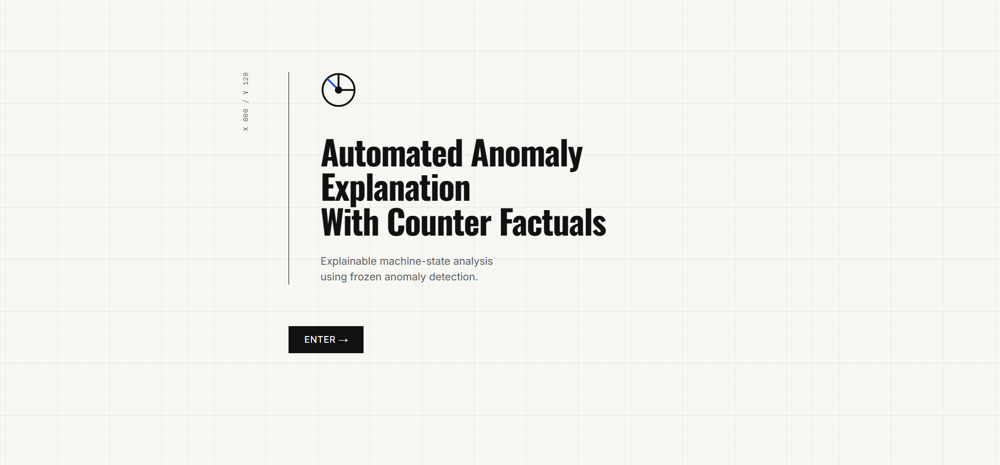
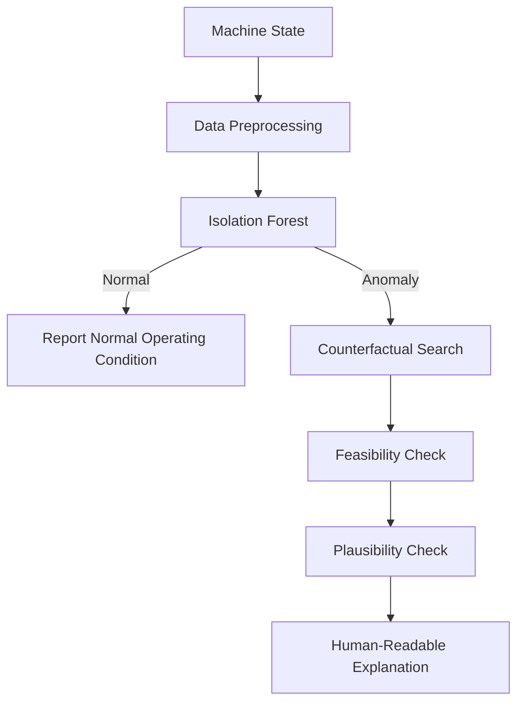
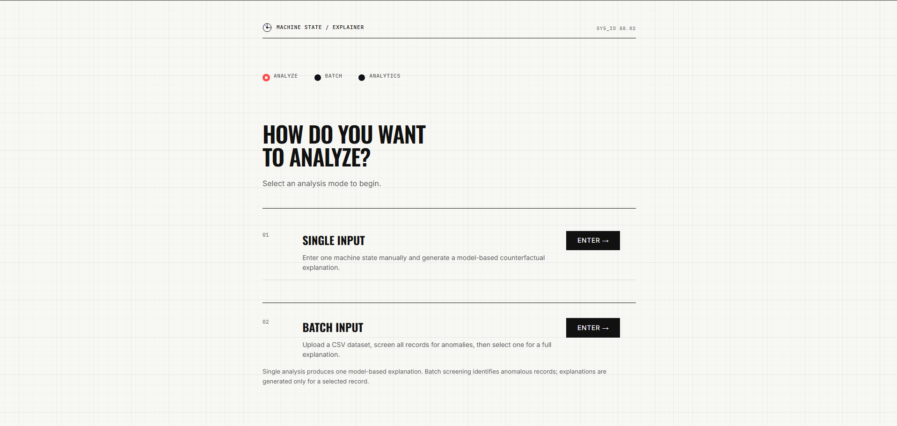
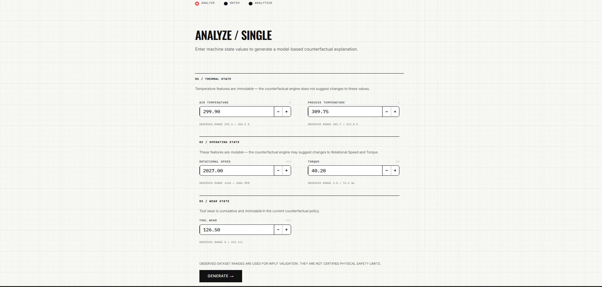
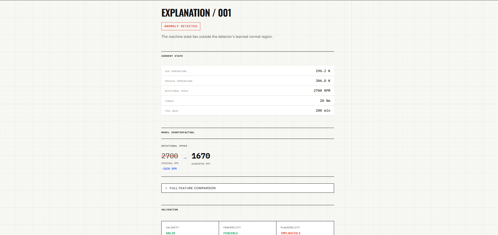
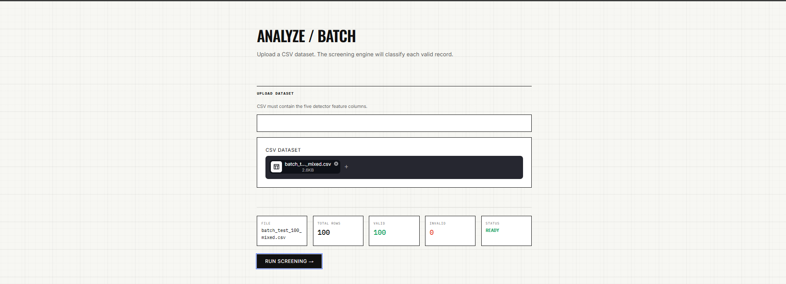
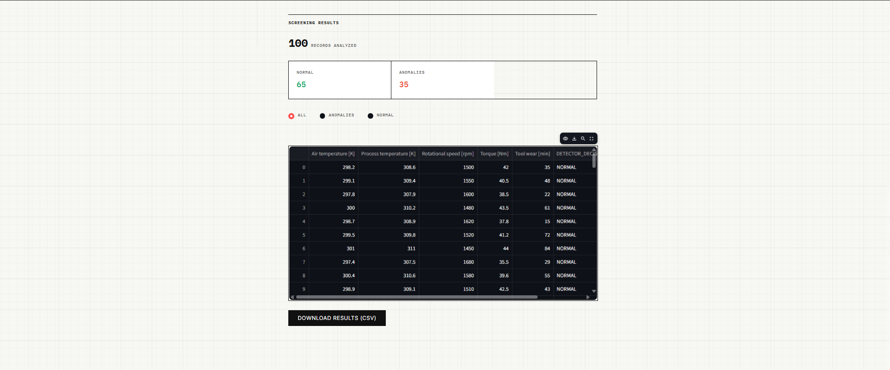

# Automated Anomaly Explanation with Counterfactuals

Anomaly detection tells us what looks abnormal. This project goes one step further by searching for a minimal model-valid alternative state and explaining the change.

 <p align="center">
  
</p>

## 🚀 Live Demo

👉 **[Try the Live Application](https://anomalycf.streamlit.app/)**
## Overview

Traditional anomaly detection systems (such as Isolation Forests) flag anomalies with a binary label or a numerical outlier score. While this alerts personnel that something is wrong, it fails to answer critical operational questions: Which physical parameters are driving the anomaly? What is the smallest operational change that will restore nominal conditions?

This project implements a **constrained counterfactual search engine** coupled to an unsupervised **Isolation Forest** detector on industrial sensor telemetry. 

It guarantees that recommended counterfactuals satisfy strict mutability constraints, domain feasibility boundaries, and empirical density checks before presenting recommendations via an industrial **Swiss Machine** dashboard and exportable HTML technical reports.

This is a **MODEL-BASED** counterfactual explanation system.

---

## Key Features

- Normal-behavior anomaly detection using Isolation Forest
- Counterfactual search for model-valid alternative states
- Minimal feature changes prioritizing sparsity and proximity
- Configured mutable/immutable feature policy
- Feasibility validation against dataset bounds
- Statistical plausibility validation via Mahalanobis distance
- Human-readable engineering explanations
- Single machine-state analysis and Batch analysis
- Downloadable explanation report (HTML and JSON)
- Interactive Swiss Machine UI built with Streamlit
- Evaluation metrics generation

---

## System Workflow



---

## Architecture

The system is organized into three logical layers:

1. **Data & Preprocessing:** Handles dataset loading, cleaning, and scaling (`src/data_loader.py`, `src/preprocessing.py`).
2. **ML & Counterfactual Engine:** Contains the core isolation forest model and search algorithms (`src/detector.py`, `src/counterfactual.py`, `src/feasibility.py`, `src/plausibility.py`, `src/evaluator.py`, `src/pipeline.py`).
3. **Streamlit Application:** The user-facing Swiss Machine dashboard (`app/app.py` and `src/explanation.py`).

---

## Dataset

Built against the **AI4I 2020 Predictive Maintenance Dataset**.

- **Total records:** 10,000
- **Known normal:** 9,661
- **Known machine failures:** 339

**Detector inputs:**
- Air temperature [K]
- Process temperature [K]
- Rotational speed [rpm]
- Torque [Nm]
- Tool wear [min]

**Training/Evaluation Split:**
- The 9,661 known-normal records are split into 7,728 for normal training and 1,933 for held-out normal evaluation.
- All 339 known machine failures are reserved strictly for evaluation.

> **Important:** The 339 known machine failures are used as an evaluation reference to validate explanations. They are NOT the number of anomalies the unsupervised Isolation Forest is required or trained to predict, as true labels are excluded from training.

---

## Machine Learning Model

**Model:** Isolation Forest

**Configuration (from `config/model_config.yaml`):**
- `n_estimators` = 300
- `contamination` = 0.01
- `random_state` = 42
- `n_jobs` = -1

**Preprocessing:** 
`StandardScaler` fitted strictly on the normal training data only.

**Score Interpretation:**
- Higher `decision_function` score → more normal
- Lower `decision_function` score → more anomalous

---

## Counterfactual Explanation

When an input is detected as anomalous, the system searches for a nearby alternative state that the current detector classifies as normal. 

The search algorithm strictly enforces mutability policies and prioritizes minimal changes.

**Mutable features:**
- Rotational speed [rpm]
- Torque [Nm]

**Immutable features:**
- Air temperature [K]
- Process temperature [K]
- Tool wear [min]
- UDI, Product ID, Type

The output is a **Model Counterfactual** or a **Model-Valid Alternative State**.

---

## Feasibility and Plausibility

**FEASIBILITY:**
Checks whether the counterfactual satisfies the configured constraints and observed dataset bounds. 
> **Important:** The configured bounds are based on observed dataset values and are NOT certified physical safety limits.

**PLAUSIBILITY:**
Checks whether the generated state is statistically consistent with the normal training distribution according to the implemented plausibility method (Mahalanobis distance).

A counterfactual can be:
- detector-valid
- feasible
- but statistically implausible

---

## Evaluation

The baseline unsupervised detector evaluation on the held-out dataset:

- **Precision:** 58.21%
- **Recall:** 11.50%
- **F1 Score:** 19.21%

**Confusion Matrix:**
| | Predicted Normal | Predicted Anomaly |
|---|---|---|
| **Actual Normal** | 1905 | 28 |
| **Actual Failure** | 300 | 39 |

**Counterfactual Evaluation:**
Evaluated conditionally on the 39 known failures that were correctly detected as anomalous by the baseline model:

- 36 / 39 detector-anomalous known failures received counterfactuals.
- 36 / 36 found counterfactuals were feasible.
- 9 / 36 found counterfactuals were statistically plausible.

---

## Example

An example of a model-valid alternative state generation:

**Original State (Anomalous):**
- Air temperature: 296.2 K
- Process temperature: 306.8 K
- Rotational speed: 2700 rpm
- Torque: 20.0 Nm
- Tool wear: 200 min

**Counterfactual (Model-Valid Alternative State):**
- Rotational speed: 2700 rpm → 1670 rpm

The model found an alternative state classified as normal by the detector by making a minimal valid adjustment to a mutable feature.

---

## Streamlit Application

The system includes a fully functional interactive UI (the **Swiss Machine** dashboard):


- **Welcome:** Overview and introduction.
- **Dashboard:** Operational metrics and quick-start links.
- **Single Input:** Run live analysis on a single machine state.
- **Batch Analysis:** Analyze multiple states simultaneously.
- **Explanation:** View the generated counterfactual delta.
- **Analytics:** View pre-generated evaluation artifacts.
- **Report Download:** Export the counterfactual explanation as a standalone HTML report or JSON result.

  <p align="center">
  
</p>

<p align="center">
  <em>Swiss Machine dashboard for selecting the analysis mode.</em>
</p>

<p align="center">
  
</p>

<p align="center">
  <em>Single machine-state analysis interface.</em>
</p>

<p align="center">
  
</p>

<p align="center">
  <em>Model-based counterfactual explanation and alternative machine state.</em>
</p>

<p align="center">
  
</p>
<p align="center">
  <em>Batch screening interface for multiple machine states.</em>
</p>

<p align="center">
  
</p>


<p align="center">
  <em>Batch screening interface for multiple machine states.</em>
</p>

## Project Structure

```text
AnomalyExplanationCF/
├── app/              # Streamlit application UI
├── config/           # YAML feature boundaries and model configurations
├── data/             # Datasets (raw and processed)
├── docs/             # Technical specifications and documentation
├── models/           # Serialized models and scalers
├── notebooks/        # Jupyter notebooks for prototyping
├── reports/          # Output directory for generated HTML reports
├── results/          # Evaluation metrics and artifact plots
├── src/              # Core ML, counterfactual, and pipeline modules
├── tests/            # Test suites and evaluation harnesses
├── README.md         # Project documentation
├── requirements.txt  # Python dependencies
└── .gitignore        # Git ignore rules
```

---

## Installation

1. Clone the repository:
```bash
git clone <https://github.com/SivaBalaji048/AnomalyExplanationCF>
cd AnomalyExplanationCF
```

2. Create a virtual environment:
**Windows:**
```powershell
python -m venv .venv
.venv\Scripts\activate
```

**Linux / macOS:**
```bash
python3 -m venv .venv
source .venv/bin/activate
```

3. Install dependencies:
```bash
pip install -r requirements.txt
```

---

## Running the Application

Launch the Streamlit interactive dashboard locally:

```bash
streamlit run app/app.py
```

---

## Testing

Run the automated test suites or evaluation scripts using the provided tools:

**Run regression contracts:**
```bash
pytest tests/test_regression_contracts.py -v
```

**Run full counterfactual quality evaluation:**
```bash
python tests/manual_ai4i_counterfactual_evaluation.py
```

**Generate evaluation results artifacts:**
```bash
python tests/manual_generate_results.py
```

---

## Limitations

- The system is **model-based, not causal**.
- Counterfactuals are **not certified safety recommendations**.
- Dataset-derived bounds are **not physical safety limits**.
- Counterfactual validity strictly depends on the trained Isolation Forest detector boundary.
- A valid and feasible counterfactual can still be statistically implausible.
- The current Isolation Forest baseline has limited recall on actual machine failures.
- No counterfactual may be found within the configured search budget.
- Dataset machine-failure labels are used for evaluation only, not detector training.

---

## Future Improvements

- Stronger detector validation and hyperparameter tuning to improve baseline recall.
- Improved counterfactual search space optimization.
- Richer physical and engineering constraints to enhance feasibility.
- Improved plausibility modeling for high-dimensional sensor data.
- Integration of domain-specific safety constraints.

---

## Disclaimer

This system provides model-based explanations of machine states. A counterfactual represents a state change that is valid according to the configured model and constraints; it is not a causal conclusion, certified safety recommendation, or guarantee of machine repair or failure prevention.
